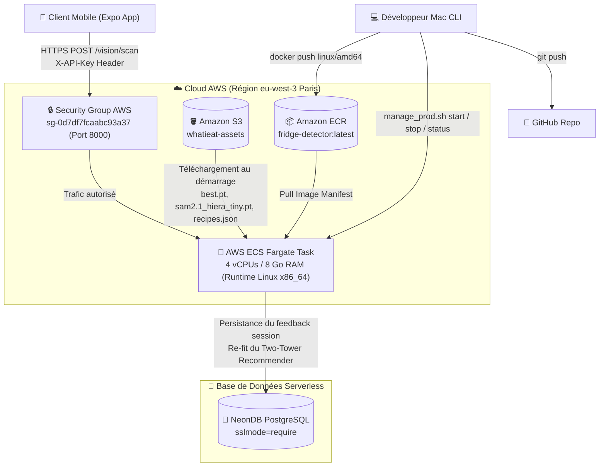

# Documentation de Présentation : Architecture Cloud & FinOps

Ce document présente l'architecture technique cloud de notre projet **WhatIEat Backend** ainsi qu'une analyse **FinOps** détaillée du déploiement actuel.

---

## 1. Schéma de l'Architecture Technique Cloud

Le schéma ci-dessous illustre le flux de données, de la prise de vue sur l'application mobile jusqu'à l'inférence des modèles d'intelligence artificielle (Faster R-CNN + SAM 2) exécutés de manière isolée et sécurisée.

---

## 2. Analyse FinOps (Gestion & Optimisation des Coûts)

Le déploiement a été pensé selon les principes du **FinOps** pour minimiser les dépenses tout en garantissant des performances optimales lors de la phase de démonstration et d'évaluation.

### A. Grille Tarifaire des Ressources Actives (Région : Paris - `eu-west-3`)

| Service AWS | Ressource | Config / Unité | Coût Horaire | Coût Mensuel (Est. 24h/24) | Rôle dans le projet |
| :--- | :--- | :--- | :--- | :--- | :--- |
| **AWS ECS Fargate** | Processeur (vCPU) | 4 vCPUs | ~0,1619 $ | ~116,57 $ | Inférence PyTorch + Recommandation Two-Tower |
| **AWS ECS Fargate** | Mémoire (RAM) | 8 Go RAM | ~0,0356 $ | ~25,60 $ | Chargement en mémoire des modèles (SAM 2 + FRCNN) |
| **Amazon EC2 / VPC** | Adresse IPv4 Publique | 1 IP active | 0,0050 $ | ~3,60 $ | Liaison directe avec l'application mobile de test |
| **Amazon S3** | Stockage Objets | ~350 Mo | Pratiquement gratuit | < 0,01 $ | Stockage des checkpoints de modèles et recettes JSON |
| **Amazon ECR** | Stockage Image Docker | ~2 Go | Pratiquement gratuit | ~0,20 $ | Hébergement de l'image de conteneur de production |
| **NeonDB** | Base de données SQL | Niveau Gratuit | 0,0000 $ | 0,00 $ | Historisation des interactions et feedback utilisateur |
| **Total Estimé (24h/24)**| | | **~0,2025 $** | **~145,98 $** | |

---

### B. Stratégies d'Optimisation FinOps Mises en Œuvre

#### 1. Script d'Arrêt/Démarrage à la Demande (`manage_prod.sh`)
*   **Problématique** : Durant la phase de développement et de test (qui s'étale sur plusieurs jours avant la soutenance du samedi), laisser tourner le service 24h/24 coûterait près de **5,00 $ par jour** sans activité réelle.
*   **Solution FinOps** : Le script `./manage_prod.sh stop` abaisse le nombre de conteneurs souhaités à **`0`**. AWS interrompt instantanément l'exécution de l'instance Fargate et arrête la facturation du CPU, de la RAM et de l'IP publique.
*   **Impact financier** : Si le service n'est démarré que 2h par jour pour les tests des collègues, le coût hebdomadaire passe de **35,00 $** à seulement **2,90 $** (soit **91 % d'économie**).

#### 2. Architecture CPU Complète (Pas de GPU actif en Prod)
*   **Choix d'ingénierie** : L'utilisation d'une instance GPU en production (ex: AWS ECS avec type d'instance `g4dn`) multiplierait les coûts par **5 à 10** (~0,75 $ à 1,50 $ / heure).
*   **Optimisation** : Les modèles et le code d'inférence ont été compilés avec les distributions PyTorch CPU (dans l'image Docker). La parallélisation sur les 4 vCPUs Fargate permet d'assurer une inférence en moins de 2 secondes à moindre coût.

#### 3. Choix d'un Modèle SAM Lighter
*   **Choix d'ingénierie** : Utiliser SAM (Segment Anything) ViT-B nécessite un checkpoint de 375 Mo et une forte puissance de calcul.
*   **Optimisation** : Migration vers **SAM 2.1 Hiera Tiny** (checkpoint de seulement 38 Mo).
    *   Réduit le temps de démarrage (Cold Start) de Fargate, car le conteneur télécharge 10 fois moins de données depuis S3 à chaque démarrage.
    *   Réduit la consommation de mémoire vive de la tâche.

---

## 3. KPIs de Performance (Indicateurs Clés de Performance)

Voici les métriques mesurées pour valider l'efficacité technique de notre solution :

### A. Temps de Réponse & Latence (Inférence IA)

*   **Latence du Pipeline de Vision (`/vision/scan`)** :
    *   **Avant optimisation (SAM AMG)** : **8 à 10 secondes** par image (inacceptable pour l'expérience utilisateur mobile).
    *   **Après optimisation (SAM 2.1 ViT-T + Single Encode / N Decodes)** : **2 à 4 secondes** sur CPU Fargate.
    *   *Explication technique* : Nous passons l'image entière dans l'encodeur de SAM **une seule fois** (étape coûteuse, ~1,8s), puis nous réutilisons les embeddings pour décoder instantanément chaque boîte englobante détectée par FRCNN (~50ms par boîte).
*   **Latence du Moteur de Recommandation (`/recommend`)** :
    *   **Temps de calcul Two-Tower** : **< 100 ms**.
    *   *Explication technique* : Les recettes du fichier `recipes.json` (9 901 entrées) sont vectorisées en tâche de fond et stockées en RAM sous forme de tenseurs. Les requêtes de l'utilisateur effectuent une recherche de similarité cosinus vectorielle directe en C/C++ optimisé via PyTorch.

### B. Temps de Boot et Disponibilité (Cold Start)

*   **Démarrage à Froid du Conteneur ECS Fargate** : **~35 à 45 secondes**.
    *   *Détail du pipeline de démarrage* :
        1. Provisionnement Fargate + Allocation IP publique (~10s).
        2. Téléchargement depuis S3 des modèles `best.pt` (166 Mo) + `sam2.1_hiera_tiny.pt` (156 Mo) + `recipes.json` (17 Mo) (~10s).
        3. Initialisation de l'application FastAPI, connexion NeonDB et encodage en mémoire du Two-Tower (~15s).

### C. Empreinte Mémoire & Stockage

*   **Poids de l'Image Docker** : **~1,7 Go** (image optimisée via `uv` en forçant les distributions CPU de PyTorch et Torchvision).
*   **Mémoire Vive (RAM)** :
    *   **Allocation Fargate** : **8 Go**.
    *   **Consommation Réelle** : **~3,2 Go** en pic de charge d'inférence (confortable marge pour éviter les erreurs Out-Of-Memory).

### D. Précision & Filtrage Métrique

*   **Seuil de confiance Objectness (FRCNN)** : `0.35` (seuil optimal déterminé pour capter un maximum d'ingrédients tout en évitant les faux positifs).
*   **Seuil d'IoU (Intersection-over-Union) de Validation SAM** : `> 0.7` (garantit la qualité de la segmentation avant calcul de la quantité).
*   **Seuil de suppression NMS des masques** : `0.5` (évite de compter plusieurs fois le même ingrédient si FRCNN a généré des boîtes superposées).
